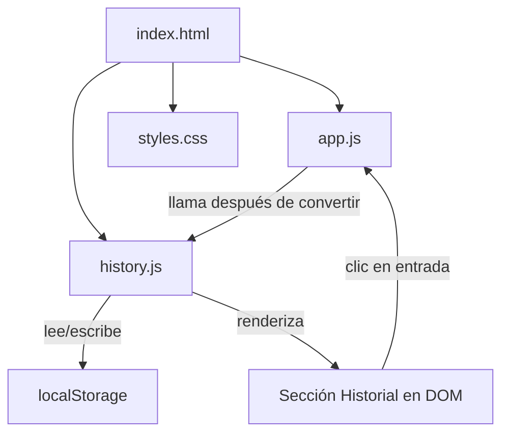
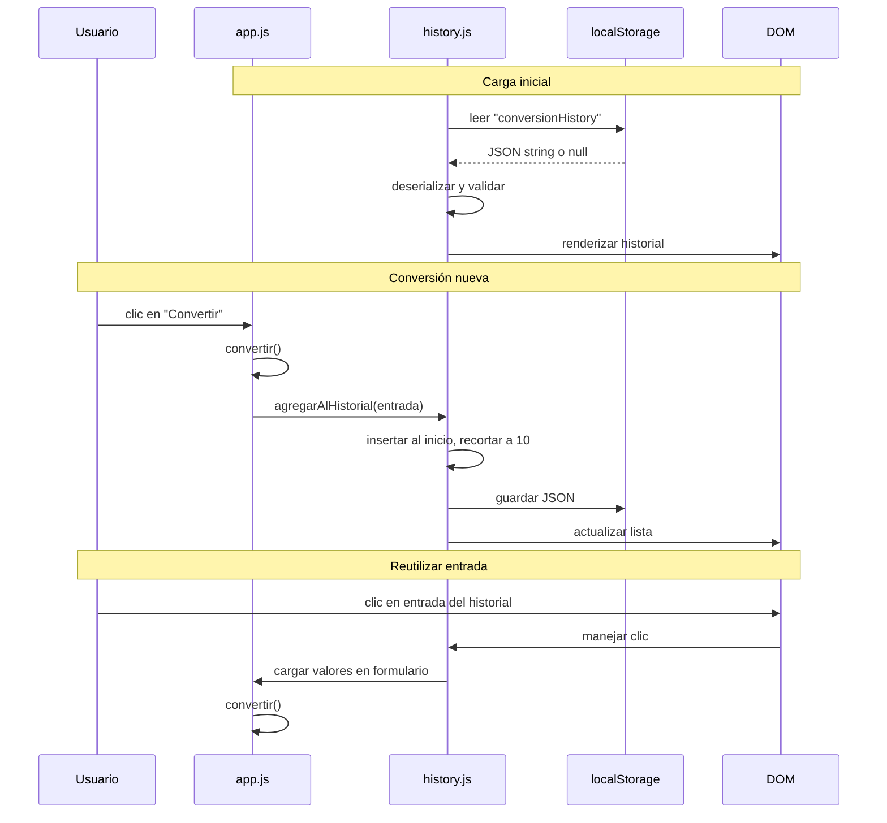

# Documento de Diseño: Historial de Conversiones

## Visión General

Esta funcionalidad extiende el Conversor de Temperaturas existente con un sistema de historial que registra, persiste y permite reutilizar conversiones previas. La arquitectura actual es una aplicación de página única con tres archivos (`index.html`, `styles.css`, `app.js`) que realiza conversiones entre Celsius, Fahrenheit y Kelvin.

El diseño agrega un módulo de historial (`history.js`) que se integra con la función `convertir()` existente. El historial se almacena en `localStorage` como JSON bajo la clave `"conversionHistory"`, se limita a 10 entradas y se renderiza debajo de la tarjeta principal. Cada entrada es clickeable para reutilizar la conversión.

### Decisiones de Diseño

1. **Módulo separado (`history.js`)**: Mantiene la separación de responsabilidades según las convenciones del proyecto. El archivo `app.js` existente se modifica mínimamente para invocar funciones del historial.
2. **localStorage con JSON**: Mecanismo nativo del navegador, sin dependencias externas. Serialización/deserialización con `JSON.stringify`/`JSON.parse`.
3. **Máximo 10 entradas**: Limita el uso de almacenamiento y mantiene la interfaz limpia. Las entradas más antiguas se eliminan automáticamente (FIFO invertido).
4. **Degradación elegante**: Si `localStorage` no está disponible, el historial funciona solo en memoria durante la sesión.

## Arquitectura

### Diagrama de Componentes



### Flujo de Datos



## Componentes e Interfaces

### 1. history.js (módulo nuevo)

Módulo principal del historial. Expone funciones globales que `app.js` invoca.

#### Funciones Públicas

```javascript
/**
 * Inicializa el historial: carga datos de localStorage y renderiza.
 * @returns {void}
 */
function inicializarHistorial() {}

/**
 * Agrega una entrada al historial después de una conversión exitosa.
 * @param {Object} entrada - La entrada de historial.
 * @param {number} entrada.valor - Valor original ingresado.
 * @param {string} entrada.desde - Unidad de origen ('C', 'F', 'K').
 * @param {string} entrada.hacia - Unidad de destino ('C', 'F', 'K').
 * @param {string} entrada.resultado - Resultado formateado (ej: "212").
 * @returns {void}
 */
function agregarAlHistorial(entrada) {}

/**
 * Elimina todas las entradas del historial y limpia localStorage.
 * @returns {void}
 */
function limpiarHistorial() {}
```

#### Funciones Internas

```javascript
/**
 * Lee la lista de conversiones desde localStorage.
 * Retorna un arreglo vacío si los datos son inválidos o no existen.
 * @returns {Array<EntradaDeHistorial>}
 */
function cargarDesdeStorage() {}

/**
 * Guarda la lista de conversiones en localStorage como JSON.
 * @param {Array<EntradaDeHistorial>} lista - La lista a guardar.
 * @returns {void}
 */
function guardarEnStorage(lista) {}

/**
 * Renderiza la lista de conversiones en el DOM.
 * Muestra mensaje vacío si no hay entradas.
 * Oculta/muestra el botón "Limpiar historial" según corresponda.
 * @param {Array<EntradaDeHistorial>} lista - La lista a renderizar.
 * @returns {void}
 */
function renderizarHistorial(lista) {}

/**
 * Maneja el clic en una entrada del historial.
 * Carga los valores en el formulario y ejecuta la conversión.
 * @param {EntradaDeHistorial} entrada - La entrada seleccionada.
 * @returns {void}
 */
function reutilizarConversion(entrada) {}

/**
 * Valida que un objeto tenga la estructura de EntradaDeHistorial.
 * @param {*} obj - El objeto a validar.
 * @returns {boolean} true si es válido.
 */
function esEntradaValida(obj) {}

/**
 * Serializa la lista de conversiones a JSON.
 * @param {Array<EntradaDeHistorial>} lista - La lista a serializar.
 * @returns {string} La cadena JSON.
 */
function serializar(lista) {}

/**
 * Deserializa una cadena JSON a lista de conversiones.
 * Retorna un arreglo vacío si la cadena es inválida.
 * @param {string} json - La cadena JSON.
 * @returns {Array<EntradaDeHistorial>}
 */
function deserializar(json) {}
```

### 2. Modificaciones a app.js

Se modifica la función `convertir()` para invocar `agregarAlHistorial()` tras una conversión exitosa. Se modifica `inicializar()` para llamar a `inicializarHistorial()`.

```javascript
// En convertir(), después de mostrar el resultado:
agregarAlHistorial({
  valor: valor,
  desde: desde,
  hacia: hacia,
  resultado: String(parseFloat(convertido.toFixed(2)))
});
```

### 3. Modificaciones a index.html

Se agrega la sección del historial después de la tarjeta principal y se incluye el script `history.js` antes de `app.js`.

```html
<!-- Después del cierre de <main class="card"> -->
<section class="history-card" aria-label="Historial de conversiones">
  <div class="history-header">
    <h2>📋 Historial</h2>
    <button id="clear-history" class="btn-clear" style="display:none;">
      Limpiar historial
    </button>
  </div>
  <ul id="history-list" role="list" aria-live="polite">
    <li class="history-empty">No hay conversiones en el historial</li>
  </ul>
</section>

<!-- Scripts: history.js ANTES de app.js -->
<script src="history.js"></script>
<script src="app.js"></script>
```

### 4. Modificaciones a styles.css

Se agregan estilos para la sección del historial, entradas clickeables y botón de limpiar.

## Modelos de Datos

### EntradaDeHistorial

```javascript
/**
 * @typedef {Object} EntradaDeHistorial
 * @property {number} valor - Valor numérico original ingresado por el usuario.
 * @property {string} desde - Unidad de origen ('C', 'F' o 'K').
 * @property {string} hacia - Unidad de destino ('C', 'F' o 'K').
 * @property {string} resultado - Resultado de la conversión formateado como string.
 */
```

### Estructura en localStorage

Clave: `"conversionHistory"`

Valor: cadena JSON que representa un arreglo de `EntradaDeHistorial`.

```json
[
  { "valor": 100, "desde": "C", "hacia": "F", "resultado": "212" },
  { "valor": 0, "desde": "C", "hacia": "K", "resultado": "273.15" }
]
```

### Reglas de Validación

| Campo      | Tipo     | Restricción                          |
|------------|----------|--------------------------------------|
| valor      | number   | Debe ser un número finito (no NaN)   |
| desde      | string   | Debe ser 'C', 'F' o 'K'             |
| hacia      | string   | Debe ser 'C', 'F' o 'K'             |
| resultado  | string   | No vacío                             |

### Invariantes

- `listaDeConversiones.length <= 10` siempre.
- Las entradas se ordenan de más reciente a más antigua (índice 0 = más reciente).
- Cada entrada cumple las reglas de validación de `EntradaDeHistorial`.

## Propiedades de Correctitud

*Una propiedad es una característica o comportamiento que debe cumplirse en todas las ejecuciones válidas de un sistema — esencialmente, una declaración formal sobre lo que el sistema debe hacer. Las propiedades sirven como puente entre especificaciones legibles por humanos y garantías de correctitud verificables por máquinas.*

### Propiedad 1: Agregar conversión crea entrada correcta al inicio

*Para toda* conversión exitosa con valor numérico válido, unidad de origen y unidad de destino, la entrada resultante en el índice 0 de la lista debe contener el valor original, la unidad de origen, la unidad de destino y el resultado formateado correctamente.

**Valida: Requisitos 1.1, 1.2**

### Propiedad 2: La lista nunca excede 10 entradas

*Para toda* secuencia de conversiones exitosas de longitud arbitraria, la longitud de la Lista_De_Conversiones debe ser siempre menor o igual a 10.

**Valida: Requisito 1.3**

### Propiedad 3: Conversiones fallidas no modifican la lista

*Para todo* valor de entrada inválido (NaN, vacío, no numérico), intentar una conversión debe dejar la Lista_De_Conversiones idéntica a su estado previo.

**Valida: Requisito 1.4**

### Propiedad 4: Formato de visualización de entradas

*Para toda* EntradaDeHistorial válida, el texto renderizado debe coincidir con el patrón `"{valor} {símbolo_origen} → {resultado} {símbolo_destino}"` donde los símbolos corresponden a la tabla `simbolos` (`°C`, `°F`, `K`).

**Valida: Requisito 2.2**

### Propiedad 5: localStorage se sincroniza tras cada mutación

*Para toda* operación que modifique la Lista_De_Conversiones (agregar o limpiar), el contenido de `localStorage.getItem("conversionHistory")` deserializado debe ser equivalente a la Lista_De_Conversiones en memoria.

**Valida: Requisito 3.1**

### Propiedad 6: Datos corruptos en localStorage producen lista vacía

*Para toda* cadena que no sea un JSON válido representando un arreglo de EntradaDeHistorial, al cargar la aplicación la Lista_De_Conversiones debe inicializarse como un arreglo vacío.

**Valida: Requisito 3.3**

### Propiedad 7: Limpiar historial elimina todo

*Para toda* Lista_De_Conversiones no vacía, ejecutar la acción de limpiar debe resultar en una lista vacía, la clave `"conversionHistory"` eliminada de localStorage, y el mensaje "No hay conversiones en el historial" visible en la interfaz.

**Valida: Requisitos 4.2, 4.3, 4.4**

### Propiedad 8: Visibilidad del botón limpiar refleja estado de la lista

*Para toda* Lista_De_Conversiones, el botón "Limpiar historial" debe estar visible si y solo si la lista contiene al menos una entrada.

**Valida: Requisito 4.5**

### Propiedad 9: Reutilizar entrada carga todos los campos y ejecuta conversión

*Para toda* EntradaDeHistorial en la lista, al hacer clic en ella, el campo "Valor" debe contener `entrada.valor`, el selector "De" debe tener `entrada.desde`, el selector "A" debe tener `entrada.hacia`, y el resultado mostrado debe corresponder a la conversión ejecutada.

**Valida: Requisitos 5.1, 5.2, 5.3, 5.4**

### Propiedad 10: Ida y vuelta de serialización

*Para toda* Lista_De_Conversiones válida, `deserializar(serializar(lista))` debe producir una lista equivalente a la original.

**Valida: Requisitos 6.1, 6.2, 6.3**

## Manejo de Errores

| Escenario | Comportamiento | Mensaje |
|-----------|---------------|---------|
| Valor de entrada no numérico | No se agrega al historial; se muestra error en resultado | "Error: ingresa un valor numérico válido" |
| localStorage no disponible | Historial funciona solo en memoria de sesión | Console: "Error: no se pudo acceder al almacenamiento local" |
| Datos corruptos en localStorage | Se inicializa lista vacía | Se muestra "No hay conversiones en el historial" |
| Error al serializar/deserializar JSON | Se usa arreglo vacío como fallback | Console: "Error: no se pudieron procesar los datos del historial" |
| Error al renderizar historial | Se muestra mensaje vacío como fallback | "No hay conversiones en el historial" |

### Estrategia General

- Todas las funciones públicas de `history.js` usan `try/catch` según las convenciones del proyecto.
- Los errores de localStorage se capturan individualmente en `cargarDesdeStorage()` y `guardarEnStorage()`.
- La función `esEntradaValida()` filtra entradas corruptas silenciosamente durante la deserialización.
- Los mensajes de error al usuario están en español según las convenciones.

## Estrategia de Testing

### Enfoque Dual

Se utilizan dos tipos de tests complementarios:

1. **Tests unitarios**: Verifican ejemplos específicos, casos borde y condiciones de error.
2. **Tests basados en propiedades**: Verifican propiedades universales con entradas generadas aleatoriamente.

### Biblioteca de Testing

- **Framework**: Jest (compatible con el ecosistema JavaScript vanilla del proyecto)
- **Property-based testing**: fast-check (biblioteca PBT para JavaScript)
- **Configuración**: Mínimo 100 iteraciones por test de propiedad

### Tests Unitarios

Cubren los siguientes escenarios:

- Historial vacío muestra mensaje correcto (Requisito 2.3)
- Sección del historial aparece debajo de la tarjeta principal (Requisito 2.1)
- Botón "Limpiar historial" existe y es visible cuando hay entradas (Requisito 4.1)
- localStorage no disponible degrada a sesión en memoria (Requisito 3.4)

### Tests Basados en Propiedades

Cada propiedad de correctitud se implementa como un único test con fast-check:

| Test | Propiedad | Etiqueta |
|------|-----------|----------|
| Entrada correcta al inicio | Propiedad 1 | Feature: conversion-history, Property 1: Adding conversion creates correct entry at index 0 |
| Máximo 10 entradas | Propiedad 2 | Feature: conversion-history, Property 2: List never exceeds 10 entries |
| Error no modifica lista | Propiedad 3 | Feature: conversion-history, Property 3: Failed conversions don't modify list |
| Formato de visualización | Propiedad 4 | Feature: conversion-history, Property 4: Entry display format is correct |
| Sincronización localStorage | Propiedad 5 | Feature: conversion-history, Property 5: localStorage syncs after mutations |
| Datos corruptos → lista vacía | Propiedad 6 | Feature: conversion-history, Property 6: Corrupt localStorage produces empty list |
| Limpiar elimina todo | Propiedad 7 | Feature: conversion-history, Property 7: Clear history removes everything |
| Visibilidad botón limpiar | Propiedad 8 | Feature: conversion-history, Property 8: Clear button visibility matches list state |
| Reutilizar carga campos | Propiedad 9 | Feature: conversion-history, Property 9: Reuse entry loads all fields and triggers conversion |
| Ida y vuelta serialización | Propiedad 10 | Feature: conversion-history, Property 10: Serialization round-trip |

### Generadores fast-check

```javascript
// Generador de unidad de temperatura válida
const unidadArb = fc.constantFrom('C', 'F', 'K');

// Generador de EntradaDeHistorial válida
const entradaArb = fc.record({
  valor: fc.double({ min: -1e6, max: 1e6, noNaN: true, noDefaultInfinity: true }),
  desde: unidadArb,
  hacia: unidadArb,
  resultado: fc.double({ min: -1e6, max: 1e6, noNaN: true, noDefaultInfinity: true })
    .map(n => String(parseFloat(n.toFixed(2))))
});

// Generador de Lista_De_Conversiones válida (0 a 10 entradas)
const listaArb = fc.array(entradaArb, { minLength: 0, maxLength: 10 });
```
